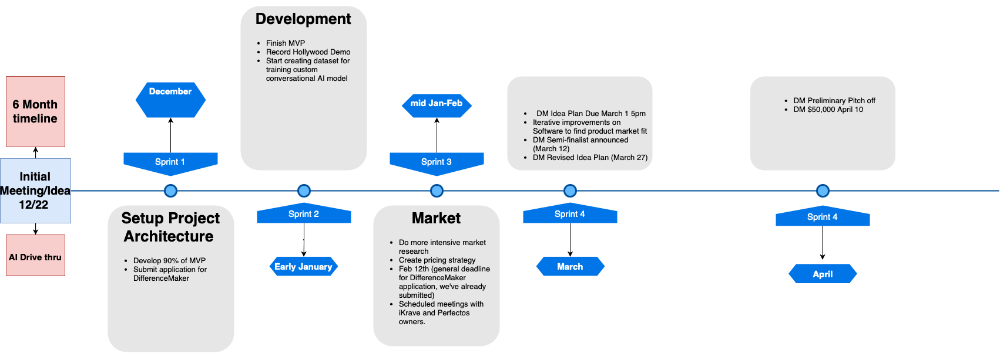

# BeanHub

## [Get us running on your machine!](https://github.com/Ibrahim-Haroon/BeanHub/wiki/Getting-Started)

## Architecture

## [Learn More](https://github.com/Ibrahim-Haroon/BeanHub/wiki)

## Timeline

